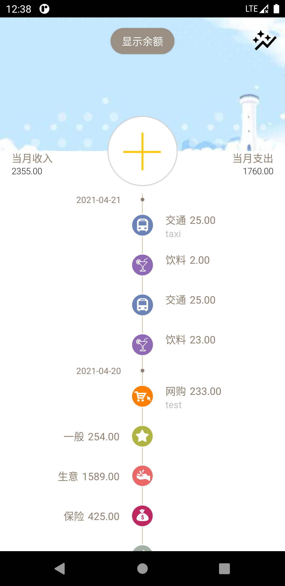

# Ucount

The purpose of writing this Android APP is to avoid bordering of ads. Everytime when we try to doing bookkeeping, we only need to open the APP, write down what we have spent / earned, then close it. The whole process may takes only serveral seconds. But many other APPs ask us see an ad when we open them. It is a waste of time.

## Details

### Main page

1. Add / delete items
### 软件截图

一开始本来打算第二界面自己重新布局的，结果发现让软键盘弹出来还是太难看了，就也写了个键盘输入

**主界面**  

**删除界面**  

**支出项目界面**    

**收入项目界面**    

**备注界面**    

**账本添加界面**  

**旧版收支界面**  

### 附加功能说明
1. 长按首页以及账本横幅可以更换图片
2. 单个项目左滑删除

### Third party libraries

- [markushi/android-circlebutton](https://github.com/markushi/android-circlebutton)

- [LitePalFramework/LitePal](https://github.com/LitePalFramework/LitePal) 

- [extensible-page-indicator](https://github.com/merhold/extensible-page-indicator)

- [MPAndroidChart](https://github.com/PhilJay/MPAndroidChart)
