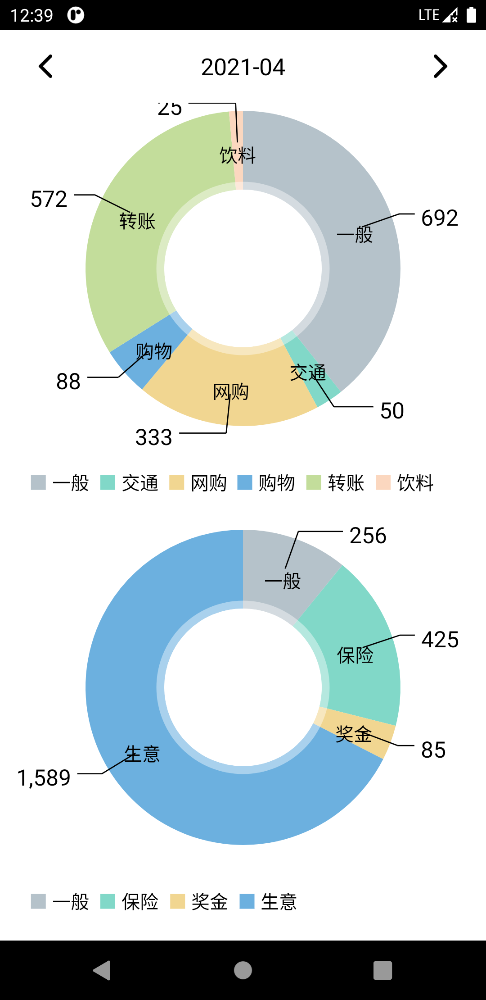
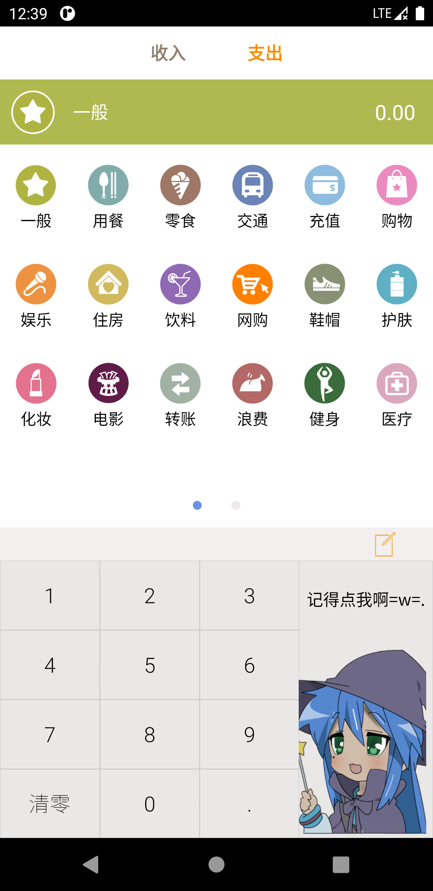
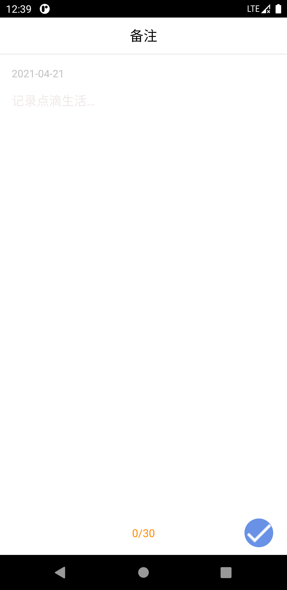
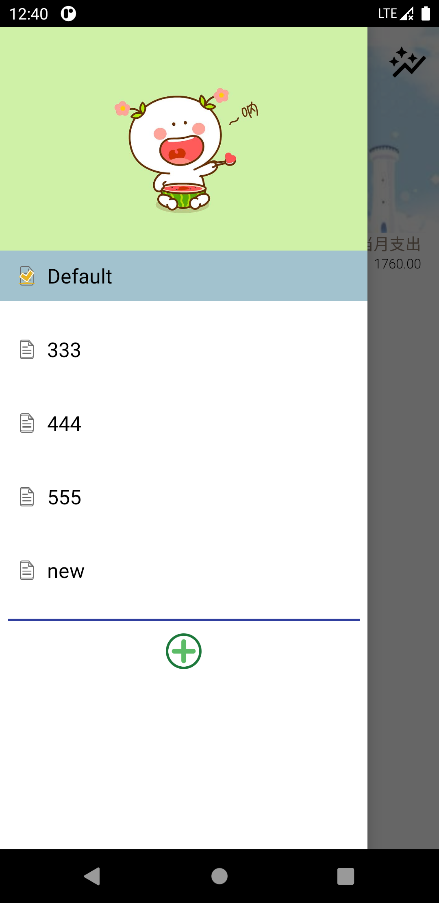

# Ucount

The purpose of writing this Android APP is to avoid bordering of ads. Everytime when we try to doing bookkeeping, we only need to open the APP, write down what we have spent / earned, then close it. The whole process may takes only serveral seconds. But many other APPs ask us see an ad when we open them. It is a waste of time.

## Details

### Main page

Items in the left side are earning and those in the right side are costs.

Click the "+" button, the APP will navigate to page which can choose earn / cost items to add.

Click the icon in the top right corner, user can surf to the statistics page.

### Statistics page

This page will display 2 pie charts of cost and earning items in one month.

### Add item page

Click the notebook button, we can add descriptions about the item.

### Description page

The description can be no more than 30 characters.

### Book page

There is a drawer in the main page. Sliding from the left edge to the right will call out the drawer. In the drawer, we can add and select different account books.

### Tips

1. Swipe from left to right to delete an item / account book.
2. Long press the header image in main page / drawer can trigger the album. Then you can choose another image to replace it.

### Third party libraries

- [markushi/android-circlebutton](https://github.com/markushi/android-circlebutton)

- [LitePalFramework/LitePal](https://github.com/LitePalFramework/LitePal) 

- [extensible-page-indicator](https://github.com/merhold/extensible-page-indicator)

- [MPAndroidChart](https://github.com/PhilJay/MPAndroidChart)
